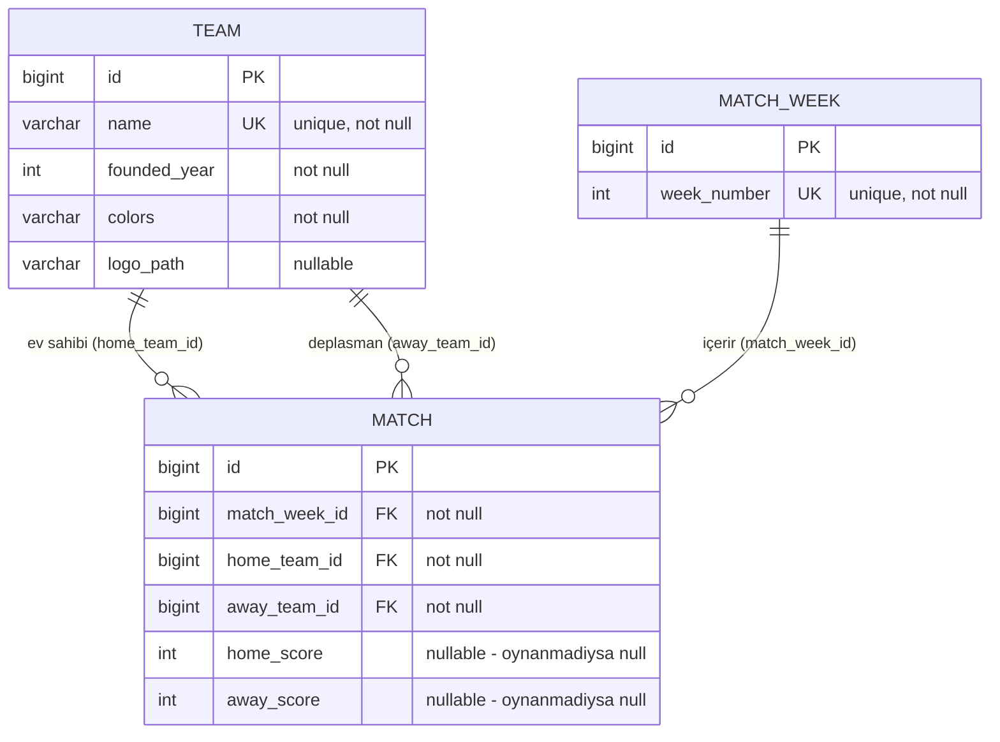

# ER Diyagramı (Taslak)

Mevcut entity'lere ([Team](backend/src/main/java/com/footballleague/entity/Team.java), [MatchWeek](backend/src/main/java/com/footballleague/entity/MatchWeek.java), [Match](backend/src/main/java/com/footballleague/entity/Match.java)) karşılık gelen veritabanı şeması.

## İlişkiler

| İlişki | Tip | Açıklama |
|---|---|---|
| `Team → Match` (ev sahibi) | 1 - N | Bir takım birden çok maçta ev sahibi olabilir |
| `Team → Match` (deplasman) | 1 - N | Bir takım birden çok maçta deplasman takımı olabilir |
| `MatchWeek → Match` | 1 - N | Bir haftada birden çok maç oynanır |

## Kasıtlı olarak eklenmeyenler

- **Ayrı bir "PuanDurumu/Standing" tablosu yok** — puan durumu, `matches` tablosundaki skorlardan servis katmanında (Faz 5) runtime hesaplanacak. Ayrı bir tabloda tutmak, maç sonucu her değiştiğinde iki yeri senkron tutma riski doğururdu.
- **Ayrı bir "Season/Lig" tablosu yok** — PoC kapsamı tek sezon/tek lig varsayıyor (spesifikasyonda çoklu sezon istenmiyor).
- **Takım gücü (strength) ve moral alanları henüz yok** — bunlar Faz 4'te (maç simülasyon motoru) `Team` entity'sine eklenecek; şu an erken eklemek kullanılmayan alanlarla şemayı şişirirdi.
