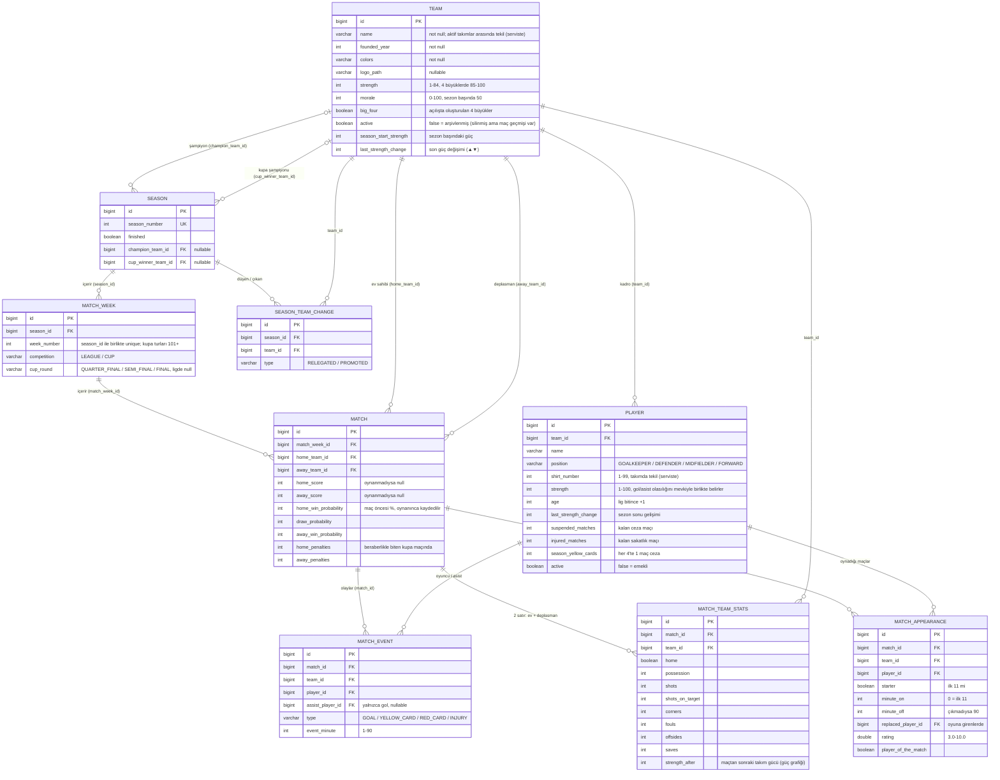

# ER Diyagramı

Mevcut entity'lere ([Team](backend/src/main/java/com/footballleague/entity/Team.java), [Player](backend/src/main/java/com/footballleague/entity/Player.java), [Season](backend/src/main/java/com/footballleague/entity/Season.java), [MatchWeek](backend/src/main/java/com/footballleague/entity/MatchWeek.java), [Match](backend/src/main/java/com/footballleague/entity/Match.java), [MatchEvent](backend/src/main/java/com/footballleague/entity/MatchEvent.java), [MatchTeamStats](backend/src/main/java/com/footballleague/entity/MatchTeamStats.java)) karşılık gelen veritabanı şeması.

```mermaid
erDiagram
    SEASON ||--o{ MATCH_WEEK : "içerir (season_id)"
    TEAM |o--o{ SEASON : "şampiyon (champion_team_id)"
    MATCH_WEEK ||--o{ MATCH : "içerir (match_week_id)"
    TEAM ||--o{ MATCH : "ev sahibi (home_team_id)"
    TEAM ||--o{ MATCH : "deplasman (away_team_id)"
    TEAM ||--o{ PLAYER : "kadro (team_id)"
    MATCH ||--o{ MATCH_EVENT : "olaylar (match_id)"
    PLAYER ||--o{ MATCH_EVENT : "oyuncu / asist"
    MATCH ||--o{ MATCH_TEAM_STATS : "2 satır: ev + deplasman"
    TEAM ||--o{ MATCH_TEAM_STATS : "team_id"
    MATCH ||--o{ MATCH_APPEARANCE : "maç kadrosu"
    PLAYER ||--o{ MATCH_APPEARANCE : "oynadığı maçlar"
    SEASON ||--o{ SEASON_TEAM_CHANGE : "düşen / çıkan"
    TEAM ||--o{ SEASON_TEAM_CHANGE : "team_id"
    TEAM |o--o{ SEASON : "kupa şampiyonu (cup_winner_team_id)"

    TEAM {
        bigint id PK
        varchar name "not null; aktif takımlar arasında tekil (serviste)"
        int founded_year "not null"
        varchar colors "not null"
        varchar logo_path "nullable"
        int strength "1-84, 4 büyüklerde 85-100"
        int morale "0-100, sezon başında 50"
        boolean big_four "açılışta oluşturulan 4 büyükler"
        boolean active "false = arşivlenmiş (silinmiş ama maç geçmişi var)"
        int season_start_strength "sezon başındaki güç"
        int last_strength_change "son güç değişimi (▲▼)"
    }

    PLAYER {
        bigint id PK
        bigint team_id FK
        varchar name
        varchar position "GOALKEEPER / DEFENDER / MIDFIELDER / FORWARD"
        int shirt_number "1-99, takımda tekil (serviste)"
        int strength "1-100, gol/asist olasılığını mevkiyle birlikte belirler"
        int age "lig bitince +1"
        int last_strength_change "sezon sonu gelişimi"
        int suspended_matches "kalan ceza maçı"
        int injured_matches "kalan sakatlık maçı"
        int season_yellow_cards "her 4'te 1 maç ceza"
        boolean active "false = emekli"
    }

    SEASON {
        bigint id PK
        int season_number UK
        boolean finished
        bigint champion_team_id FK "nullable"
        bigint cup_winner_team_id FK "nullable"
    }

    SEASON_TEAM_CHANGE {
        bigint id PK
        bigint season_id FK
        bigint team_id FK
        varchar type "RELEGATED / PROMOTED"
    }

    MATCH_WEEK {
        bigint id PK
        bigint season_id FK
        int week_number "season_id ile birlikte unique; kupa turları 101+"
        varchar competition "LEAGUE / CUP"
        varchar cup_round "QUARTER_FINAL / SEMI_FINAL / FINAL, ligde null"
    }

    MATCH {
        bigint id PK
        bigint match_week_id FK
        bigint home_team_id FK
        bigint away_team_id FK
        int home_score "oynanmadıysa null"
        int away_score "oynanmadıysa null"
        int home_win_probability "maç öncesi %, oynanınca kaydedilir"
        int draw_probability
        int away_win_probability
        int home_penalties "beraberlikle biten kupa maçında"
        int away_penalties
    }

    MATCH_APPEARANCE {
        bigint id PK
        bigint match_id FK
        bigint team_id FK
        bigint player_id FK
        boolean starter "ilk 11 mi"
        int minute_on "0 = ilk 11"
        int minute_off "çıkmadıysa 90"
        bigint replaced_player_id FK "oyuna girenlerde"
        double rating "3.0-10.0"
        boolean player_of_the_match
    }

    MATCH_EVENT {
        bigint id PK
        bigint match_id FK
        bigint team_id FK
        bigint player_id FK
        bigint assist_player_id FK "yalnızca gol, nullable"
        varchar type "GOAL / YELLOW_CARD / RED_CARD / INJURY"
        int event_minute "1-90"
    }

    MATCH_TEAM_STATS {
        bigint id PK
        bigint match_id FK
        bigint team_id FK
        boolean home
        int possession
        int shots
        int shots_on_target
        int corners
        int fouls
        int offsides
        int saves
        int strength_after "maçtan sonraki takım gücü (güç grafiği)"
    }
```

## İlişkiler

| İlişki | Tip | Açıklama |
|---|---|---|
| `Season → MatchWeek` | 1 - N | Her sezonun kendi haftaları var (hafta numarası sezon içinde tekil) |
| `Season → Team` (şampiyon) | N - 1 | Sezon bitince şampiyon kaydedilir |
| `MatchWeek → Match` | 1 - N | Bir haftada birden çok maç oynanır |
| `Team → Match` | 1 - N | Ev sahibi ve deplasman için iki ayrı ilişki |
| `Team → Player` | 1 - N | 18 kişilik kadro |
| `Match → MatchEvent` | 1 - N | Goller (+ asist), sarı ve kırmızı kartlar |
| `Match → MatchTeamStats` | 1 - 2 | Oynanmış her maçta ev sahibi ve deplasman için birer satır |
| `Match → MatchAppearance` | 1 - N | Her oynanmış maçta iki takımın ilk 11'i ve oyuna girenler |
| `Season → SeasonTeamChange` | 1 - N | Sezon sonunda düşen ve yükselen takımlar |

## Kasıtlı olarak eklenmeyenler

- **Ayrı bir "PuanDurumu/Standing" tablosu yok.** Puan durumu, `matches` tablosundaki skorlardan servis katmanında runtime hesaplanıyor (`StandingsCalculator`). Sıra değişimi de aynı hesaplamanın son hafta hariç tekrarıyla bulunuyor. Ayrı tablo, iki yeri senkron tutma riski doğururdu.
- **Ayrı bir oyuncu istatistik tablosu yok.** Gol, asist, kart ve sakatlıklar `match_events`'e, oynanan dakika ve reyting `match_appearances`'a maç oynandığında kalıcı yazılıyor; sezon ve kariyer toplamları bu tablolardan sayılıyor.
- **Kupa için ayrı maç tablosu yok.** Kupa maçları da `matches`'ta; ait oldukları haftanın `competition = CUP` olması ayırıyor. Puan durumu, fikstür ve gol krallığı yalnızca lig haftalarını okuyor. Böylece maç detayı ile oyuncu istatistikleri hiçbir zaman çelişmiyor.
- **Kart sayıları istatistik tablosunda yok.** `match_events`'ten sayılıyor; aynı bilgiyi iki yerde tutmamak için.
- **Takım adı DB'de unique değil.** Arşivlenen takımın adı yeni bir takımda tekrar kullanılabilsin diye. Tekillik, aktif takımlar arasında servis katmanında kontrol ediliyor.
- **Sezon bazlı güç geçmişi tutulmuyor.** Yalnızca sezon başı gücü ve son değişim tutuluyor; ok göstergeleri için bu kadarı yeterli.
